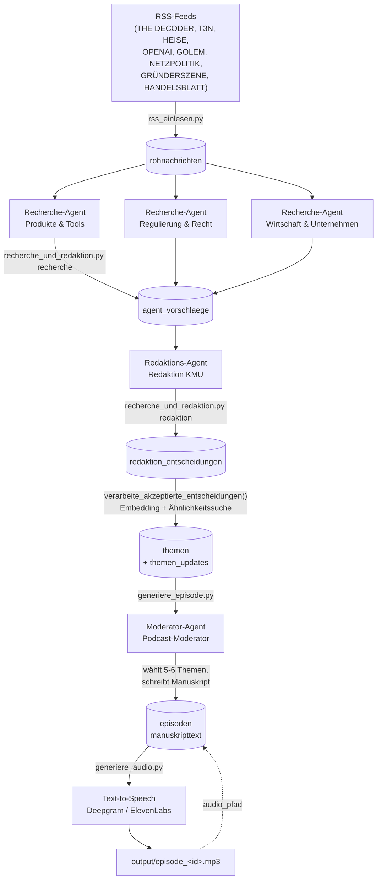

# Podcast

## 1. Überblick

Dieses System erzeugt automatisiert einen deutschsprachigen KI-News-Podcast für Geschäftsführer kleiner/mittlerer Unternehmen. Mehrere KI-Recherche-Agenten filtern relevante Nachrichten aus RSS-Feeds, ein Redaktions-Agent entscheidet, was davon in die nächste Folge kommt, und ein Moderator-Agent schreibt daraus ein Manuskript im Storytelling-Stil. Am Ende wird das Manuskript per Text-to-Speech in eine fertige MP3-Datei umgewandelt. Alle Agenten (Recherche, Redaktion, Moderator) werden über eine einzige Datenbank-Tabelle konfiguriert, ohne dass Code geändert werden muss.

## 2. Architektur / Datenfluss



**Kurz in Worten:** RSS-Feeds werden roh in `rohnachrichten` gespeichert. Jeder der drei Recherche-Agenten sucht sich daraus 3-5 für seinen Fokus relevante Nachrichten und legt sie als Vorschlag ab. Der Redaktions-Agent sieht alle offenen Vorschläge aller Recherche-Agenten und akzeptiert 4-6 davon. Akzeptierte Entscheidungen werden per Embedding-Ähnlichkeitssuche einem Thema zugeordnet (neues Thema, Update zu bestehendem Thema, oder Duplikat). Der Moderator wählt aus allen offenen Themen die 5-6 wichtigsten aus und schreibt das Manuskript. Zuletzt wird daraus eine MP3 erzeugt.

## 3. Die KI-Agenten

Alle Agenten liegen in der Tabelle `agenten_konfiguration` (Spalten: `name`, `rolle`, `fokus_beschreibung`, `aktiv`). Der `fokus_beschreibung`-Text wird 1:1 als Systemkontext in den jeweiligen Gemini-Prompt eingebaut - das ist der zentrale Hebel, um das Verhalten eines Agenten zu ändern, ohne Code anzufassen.

### Recherche-Agenten (`rolle = 'recherche'`)

Aktuell drei Stück, alle mit identischer Logik, aber unterschiedlichem Fokus:

| Name | Fokus |
|---|---|
| Produkte & Tools | Neue KI-Modelle, Feature-Releases, Tool-Ankündigungen |
| Regulierung & Recht | EU AI Act, Datenschutz, Gerichtsurteile, Politik |
| Wirtschaft & Unternehmen | Investitionen, Marktentwicklungen, Praxisbeispiele deutscher Unternehmen |

**Was sie tun:** Jeder Recherche-Agent bekommt alle `rohnachrichten` der letzten 3 Tage, die er noch nicht bewertet hat, und wählt per Gemini die 3-5 relevantesten für seinen Fokus aus (`waehle_relevante_nachrichten` in `recherche_und_redaktion.py`). Die Auswahl landet mit Begründung in `agent_vorschlaege`.

**Ändern:** Table Editor in Supabase öffnen → Tabelle `agenten_konfiguration` → Zeile mit `name = 'Produkte & Tools'` (bzw. dem gewünschten Agenten) → Spalte `fokus_beschreibung` bearbeiten. Beispiel: Wenn "Produkte & Tools" sich stärker auf Open-Source-Modelle statt kommerzielle Tools konzentrieren soll, den Fokus-Text entsprechend umschreiben.

**Einzeln testen** (mit einer Zusatz-Anweisung nur für diesen Durchlauf, ohne die gespeicherte Konfiguration zu ändern):

```python
from recherche_und_redaktion import fuehre_einzelnen_agenten_aus

fuehre_einzelnen_agenten_aus(
    "Produkte & Tools",
    "Achte diesmal besonders auf Open-Source-Modelle."
)
```

Oder über die Kommandozeile:

```
python recherche_und_redaktion.py agent "Produkte & Tools" "Achte diesmal besonders auf Open-Source-Modelle."
```

### Redaktions-Agent (`rolle = 'redaktion'`)

Aktuell ein Agent: **Redaktion KMU** (fokus: Perspektive eines Geschäftsführers eines kleinen deutschen Unternehmens).

**Was er tut:** Sieht alle offenen Vorschläge aller Recherche-Agenten gemeinsam, wählt die 4-6 wichtigsten aus und gibt für JEDEN Vorschlag (auch die abgelehnten) eine Begründung ab (`entscheide_ueber_vorschlaege`). Die Entscheidungen landen in `redaktion_entscheidungen`.

**Ändern:** Table Editor → `agenten_konfiguration` → Zeile mit `name = 'Redaktion KMU'` → `fokus_beschreibung` bearbeiten. Beispiel: Um strenger zu selektieren, im Fokus-Text ergänzen "Lehne alles ab, was nicht in den nächsten 4 Wochen praktisch relevant ist."

**Einzeln testen:**

```python
from recherche_und_redaktion import fuehre_einzelnen_agenten_aus

fuehre_einzelnen_agenten_aus(
    "Redaktion KMU",
    "Sei diesmal strenger - nur Themen mit akutem Handlungsbedarf akzeptieren."
)
```

### Moderator (`rolle = 'moderator'`)

Ein Agent: **Podcast-Moderator** (Ton: direkt, "ihr"-Ansprache, kein Hype, Fristen/Risiken zuerst).

**Was er tut:** Bekommt alle offenen Themen (Status "neu" oder "in Verfolgung") samt Update-Historie, wählt die 5-6 wichtigsten aus und schreibt das komplette Episoden-Manuskript (`erstelle_episode` in `generiere_episode.py`). Der Moderator-Fokus wird dabei mit dem festen Struktur-Prompt aus `baue_manuskript_prompt` kombiniert (siehe Abschnitt 6).

**Ändern:** Table Editor → `agenten_konfiguration` → Zeile mit `rolle = 'moderator'` → `fokus_beschreibung` bearbeiten. Das steuert den grundsätzlichen Ton/die Persona; Länge, Aufbau, Humor etc. liegen dagegen im Code (Abschnitt 6).

**Einzeln testen** (Achtung: erzeugt eine echte Episode in `episoden` und markiert Themen als "gesendet" - siehe Abschnitt 8 zum Zurücksetzen):

```python
from generiere_episode import erstelle_episode

erstelle_episode("Fasse diesmal nur die drei wichtigsten Themen zusammen.")
```

Es gibt aktuell **keinen** `fuehre_einzelnen_agenten_aus`-Test für den Moderator ohne Seiteneffekte - jeder Aufruf von `erstelle_episode` legt eine echte Zeile in `episoden` an und markiert Themen als gesendet.

## 4. Die Datenbank

| Tabelle | Zweck | Wichtige Spalten | Verknüpfung |
|---|---|---|---|
| `rohnachrichten` | Rohe RSS-Einträge, unverarbeitet | `quelle`, `url` (unique), `titel`, `text`, `abrufzeitpunkt` | - |
| `agenten_konfiguration` | Konfiguration aller Agenten (Recherche, Redaktion, Moderator) | `name`, `rolle` (recherche/redaktion/moderator), `fokus_beschreibung`, `aktiv` | - |
| `agent_vorschlaege` | Von Recherche-Agenten vorgeschlagene Rohnachrichten | `agent_id`, `rohnachricht_id`, `begruendung`, `vorgeschlagen_am` | `agent_id` → `agenten_konfiguration.id`; `rohnachricht_id` → `rohnachrichten.id` |
| `redaktion_entscheidungen` | Redaktions-Entscheidungen zu jedem Vorschlag | `vorschlag_id`, `akzeptiert`, `begruendung`, `thema_id` (nullable), `entschieden_am` | `vorschlag_id` → `agent_vorschlaege.id`; `thema_id` → `themen.id` (wird erst nach `verarbeite_akzeptierte_entscheidungen()` befüllt) |
| `themen` | Konsolidierte Themen (nach Dedup) | `titel`, `zusammenfassung`, `status` (neu / in Verfolgung / gesendet), `erster_kontaktzeitpunkt`, `letztes_update`, `embedding` (vector(768), Gemini) | - |
| `themen_updates` | Historie neuer Fakten zu einem bestehenden Thema | `thema_id`, `was_neu`, `datum` | `thema_id` → `themen.id` (cascade delete) |
| `episoden` | Fertige Episoden | `datum`, `manuskripttext`, `audio_pfad`, `kosten` (aktuell nirgends befüllt) | - |

Ähnlichkeitssuche für Dedup läuft über die SQL-Funktion `finde_aehnliche_themen(such_embedding, schwellenwert)` (Cosine Similarity via `pgvector`/HNSW-Index auf `themen.embedding`).

## 5. Auswahl-Kriterien: Wie ein Thema es in die Folge schafft

1. **Recherche:** Jeder der 3 Recherche-Agenten filtert unabhängig aus den `rohnachrichten` der letzten 3 Tage die für seinen Fokus 3-5 relevantesten aus (Gemini-Prompt in `waehle_relevante_nachrichten`). Bereits bewertete Rohnachrichten werden pro Agent nicht erneut vorgeschlagen.
2. **Vorschlag:** Diese Auswahl landet mit Begründung in `agent_vorschlaege` - noch unabhängig von den anderen Agenten, es gibt hier keine Deduplizierung zwischen den drei Recherche-Agenten.
3. **Redaktions-Bewertung:** Der Redaktions-Agent sieht ALLE offenen Vorschläge aller Recherche-Agenten zusammen und wählt die 4-6 wichtigsten aus der Perspektive eines KMU-Geschäftsführers (`entscheide_ueber_vorschlaege`). Für jeden Vorschlag - auch abgelehnte - wird eine Begründung gespeichert (`redaktion_entscheidungen`).
4. **Dedup/Update-Check über Embeddings:** `verarbeite_akzeptierte_entscheidungen()` nimmt jede akzeptierte, noch nicht verknüpfte Entscheidung und lässt Titel+Text der zugehörigen Rohnachricht durch dieselbe Logik wie `verarbeite_rohnachricht.py` laufen:
   - Gemini-Embedding erzeugen
   - Per `finde_aehnliche_themen` (Schwellenwert 0.85, Cosine Similarity) nach einem bestehenden, ähnlichen Thema suchen
   - Gibt es einen Treffer: Gemini prüft, ob der neue Text einen konkreten neuen Fakt enthält → entweder Eintrag in `themen_updates` (Update) oder Verwerfen als Duplikat (nur Verknüpfung, kein neuer Inhalt)
   - Kein Treffer: neues Thema in `themen` mit Status `neu`
5. **Finale Manuskript-Auswahl:** `generiere_episode.py` holt alle Themen mit Status `neu` oder `in Verfolgung` (unabhängig davon, wie sie entstanden sind) und lässt den Moderator-Agenten daraus die 5-6 wichtigsten für die aktuelle Folge auswählen (Abschnitt "THEMENAUSWAHL" im Prompt, siehe Abschnitt 6). Nur die vom Moderator tatsächlich verwendeten Themen werden danach auf Status `gesendet` gesetzt; die übrigen bleiben offen für die nächste Folge.

## 6. Wie man den Manuskript-Stil ändert

Der komplette Struktur-Prompt liegt in **`generiere_episode.py`**, Funktion **`baue_manuskript_prompt`**. Er kombiniert die Moderator-Persona (aus der DB, siehe Abschnitt 3) mit fest im Code hinterlegten Abschnitten:

| Abschnitt im Prompt | Steuert |
|---|---|
| `THEMENAUSWAHL` | Wie viele Themen ausgewählt werden (aktuell 5-6) |
| `LÄNGE` | Ziel-Wortzahl (aktuell 1400-1600 Wörter) und wie diese erreicht wird (Tiefe statt mehr Themen) |
| `AUFBAU DER EPISODE` | Hook-Einstieg, Drei-Teile-Struktur pro Thema, Übergänge zwischen Themen, Variation von Satzenden/-anfängen und Übergangsformulierungen, Abschluss |
| `HUMOR` | Ob/wo trockener Humor eingebaut wird, und wo explizit nicht (ernste Themen) |

Um etwas zu ändern: die Datei direkt öffnen, den passenden Textblock in `baue_manuskript_prompt` bearbeiten. Es ist reiner Prompt-Text (deutsche Sätze), kein strukturierter Code - keine Programmierkenntnisse nötig, um z.B. die Wortzahl-Grenzen oder die Humor-Regeln anzupassen.

Am Ende des Prompts wird die KI zusätzlich angewiesen, als letzte Zeile `VERWENDETE_THEMEN_IDS: <id1>,<id2>,...` zurückzugeben. Diese Zeile wird von `erstelle_manuskript` per Regex herausgeschnitten (landet NICHT im gespeicherten `manuskripttext`) und dient nur dazu, die verwendeten Themen korrekt auf Status `gesendet` zu setzen.

## 7. Setup / Wie man das Projekt zum Laufen bringt

### Benötigte `.env`-Variablen

```
SUPABASE_URL=
SUPABASE_KEY=
GEMINI_API_KEY=
DEEPGRAM_API_KEY=
ELEVENLABS_API_KEY=
```

Zusätzlich in `.env` vorhanden, aber aktuell **nicht** von der Haupt-Pipeline verwendet (nur experimentell in `test_apis.py`):

```
OPENAI_API_KEY=
TAVILY_API_KEY=
EXA_API_KEY=
```

### Kompletter Durchlauf (Reihenfolge)

```
python rss_einlesen.py
python recherche_und_redaktion.py recherche
python recherche_und_redaktion.py redaktion
python recherche_und_redaktion.py verarbeite
python generiere_episode.py
```

Danach Audio erzeugen (aktuell kein fertiges CLI-Skript dafür, kurzes Python-Snippet):

```python
from supabase import create_client
import os
from dotenv import load_dotenv
from generiere_audio import text_zu_audio

load_dotenv()
sb = create_client(os.environ["SUPABASE_URL"], os.environ["SUPABASE_KEY"])

episode_id = "..."  # id aus der Konsolen-Ausgabe von generiere_episode.py
text = sb.table("episoden").select("manuskripttext").eq("id", episode_id).limit(1).execute().data[0]["manuskripttext"]

dateipfad = f"output/episode_{episode_id}.mp3"
text_zu_audio(text, dateipfad)
sb.table("episoden").update({"audio_pfad": dateipfad}).eq("id", episode_id).execute()
```

### Einmalig / bei Bedarf

- `embeddings_backfill.py` - erzeugt fehlende Embeddings für Themen ohne `embedding`-Wert (Wartungsskript, kein fester Bestandteil des regulären Durchlaufs).

## 8. Bekannte Einschränkungen

- **Row Level Security ist aktuell deaktiviert** - keine der Tabellen hat RLS-Policies. Der Code verwendet direkt den Supabase-Service-Key; dieser Key darf niemals client-seitig (Browser, App) verwendet werden.
- **Deepgram-Speed-Control funktioniert nur bei englischen Aura-2-Stimmen** (`DEEPGRAM_SPEED_SPRACHEN = ("en",)`). Das deutsche Standardmodell `aura-2-julius-de` lehnt Anfragen mit `speed`-Parameter komplett ab (400 Bad Request) - der Code umgeht das automatisch, indem er `speed` bei deutschen Stimmen weglässt.
- **Deepgram hat ein Limit von 2000 Zeichen pro Anfrage.** Längere Manuskripte werden automatisch an Satzgrenzen in Chunks aufgeteilt (`_teile_text`) und die Audio-Teile zusammengefügt.
- **ElevenLabs-Kontingent ist begrenzt** - für finale/echte Aufnahmen aufheben, für Tests Deepgram (Standard-Anbieter) nutzen.
- **`google.generativeai` (Python-Paket) ist deprecated** (Gemini-Team empfiehlt Umstieg auf `google.genai`) - erzeugt aktuell bei jedem Lauf eine `FutureWarning`, funktioniert aber noch.
- **Kein zentrales Orchestrierungsskript** - der komplette Ablauf von RSS bis Audio muss aktuell manuell Schritt für Schritt gestartet werden (siehe Abschnitt 7).
- **Themen-Markierung ist konservativ:** Liefert die Moderator-KI keine gültige `VERWENDETE_THEMEN_IDS`-Zeile, wird sicherheitshalber **kein** Thema als "gesendet" markiert (Warnung in der Konsole) - besser als fälschlich Themen zu verlieren, kann aber dazu führen, dass Themen manuell nachgepflegt werden müssen.
- **`episoden.kosten` wird aktuell nirgends befüllt** - keine Kostenerfassung pro Episode implementiert.
- **`themen.quelle` wird aktuell nirgends befüllt.**

## 9. Häufige Änderungen - Schnellreferenz

| Ich will... | Was ändern | Wie |
|---|---|---|
| Anderen Themenbereich für einen Agenten | `fokus_beschreibung` | Table Editor, `agenten_konfiguration` |
| Anderer Podcast-Ton/Persona | `fokus_beschreibung` (Zeile `rolle='moderator'`) | Table Editor, `agenten_konfiguration` |
| Manuskript länger/kürzer | Prompt in `generiere_episode.py` | Datei direkt, Abschnitt "LÄNGE" |
| Mehr/weniger Humor | Prompt in `generiere_episode.py` | Datei direkt, Abschnitt "HUMOR" |
| Andere Stimme/Anbieter | `generiere_audio.py` | `anbieter`-Parameter (`"deepgram"`/`"elevenlabs"`), bzw. `DEEPGRAM_MODEL`/`ELEVENLABS_VOICE_ID` |
| Mehr/weniger Themen pro Folge | Prompt in `generiere_episode.py` | Abschnitt "THEMENAUSWAHL" |
| Strengere/lockerere Redaktion | `fokus_beschreibung` (Zeile `rolle='redaktion'`) | Table Editor, `agenten_konfiguration` |
| Neue RSS-Quelle hinzufügen | `FEEDS`-Liste | `rss_einlesen.py` |
| Einen Agenten deaktivieren, ohne ihn zu löschen | `aktiv` auf `false` | Table Editor, `agenten_konfiguration` |
| Neuen Recherche-Agenten hinzufügen | neue Zeile mit `rolle='recherche'` | Table Editor, `agenten_konfiguration` |
| Wie viele Nachrichten ein Recherche-Agent vorschlägt | Prompt-Text "3-5 relevantesten" | `waehle_relevante_nachrichten` in `recherche_und_redaktion.py` |
| Wie viele Themen die Redaktion akzeptiert | Prompt-Text "4-6 wichtigsten" | `entscheide_ueber_vorschlaege` in `recherche_und_redaktion.py` |
| Wie ähnlich zwei Nachrichten sein müssen, um als "gleiches Thema" zu gelten | `SCHWELLENWERT` (aktuell 0.85) | `verarbeite_rohnachricht.py` |
| Wie alt Nachrichten maximal sein dürfen | `MAX_ALTER_TAGE` | `rss_einlesen.py` bzw. `recherche_und_redaktion.py` |
| Sprechgeschwindigkeit der Audiodatei | `DEEPGRAM_SPEED_STANDARD` | `generiere_audio.py` (wirkt nur bei englischen Stimmen) |
| Welches Gemini-Modell für Text/Redaktion verwendet wird | `CHAT_MODEL` | jeweils oben in `generiere_episode.py` / `recherche_und_redaktion.py` / `verarbeite_rohnachricht.py` |

---

**Änderungswünsche am einfachsten so kommunizieren:** "Ich will, dass [Agent/Teil] X macht statt Y" - z.B. "Ich will, dass die Redaktion strenger auswählt" oder "Ich will, dass der Moderator weniger Humor nutzt". Damit lässt sich direkt der passende Abschnitt bzw. die passende Konfigurationszeile gezielt anpassen, ohne das ganze System neu durchdenken zu müssen.
