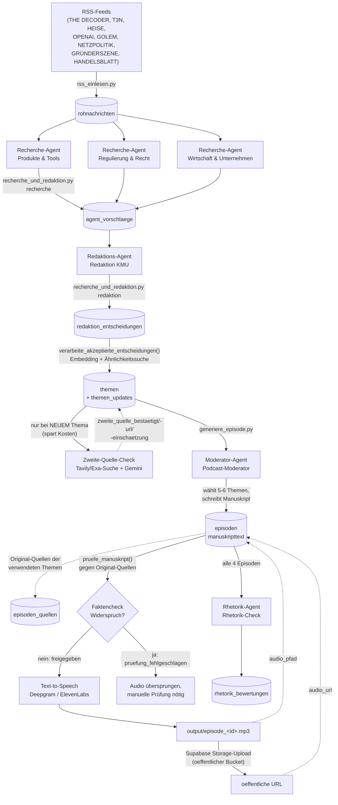

# Podcast

## 1. Überblick

Dieses System erzeugt automatisiert einen deutschsprachigen KI-News-Podcast für Geschäftsführer kleiner/mittlerer Unternehmen. Mehrere KI-Recherche-Agenten filtern relevante Nachrichten aus RSS-Feeds, ein Redaktions-Agent entscheidet, was davon in die nächste Folge kommt, und ein Moderator-Agent schreibt daraus ein Manuskript im Storytelling-Stil. Am Ende wird das Manuskript per Text-to-Speech in eine fertige MP3-Datei umgewandelt. Alle Agenten (Recherche, Redaktion, Moderator) werden über eine einzige Datenbank-Tabelle konfiguriert, ohne dass Code geändert werden muss.

## 2. Architektur / Datenfluss



**Kurz in Worten:** RSS-Feeds werden roh in `rohnachrichten` gespeichert. Jeder der drei Recherche-Agenten sucht sich daraus 3-5 für seinen Fokus relevante Nachrichten und legt sie als Vorschlag ab. Der Redaktions-Agent sieht alle offenen Vorschläge aller Recherche-Agenten und akzeptiert 4-6 davon. Akzeptierte Entscheidungen werden per Embedding-Ähnlichkeitssuche einem Thema zugeordnet (neues Thema, Update zu bestehendem Thema, oder Duplikat) - entsteht dabei ein neues Thema, sucht zusätzlich eine Zweite-Quelle-Verifikation (Tavily/Exa + Gemini) nach unabhängiger Bestätigung des Kernfakts. Der Moderator wählt aus allen offenen Themen die 5-6 wichtigsten aus und schreibt das Manuskript; die dabei verwendeten Original-Quellen werden dauerhaft in `episoden_quellen` festgehalten. Bevor daraus Audio erzeugt wird, prüft ein Faktencheck-Schritt das Manuskript gegen die Original-Quellen; nur bei Freigabe wird die MP3 erzeugt (als allererste Zeile im Manuskript steht dabei immer ein fester KI-Kennzeichnungshinweis, siehe Abschnitt 6). Die fertige MP3 wird lokal gespeichert UND zusätzlich in einen öffentlichen Supabase-Storage-Bucket hochgeladen, damit eine stabile URL unabhängig von GitHub-Actions-Artefakten oder dem lokalen Rechner existiert. Unabhängig davon prüft alle 4 Episoden ein Rhetorik-Agent die zuletzt erschienenen Manuskripte auf Wiederholungen und die Balance zwischen Storytelling und Nachrichtenkern - rein informativ, ohne automatische Änderung.

## 3. Die KI-Agenten

Alle Agenten liegen in der Tabelle `agenten_konfiguration` (Spalten: `name`, `rolle`, `fokus_beschreibung`, `aktiv`). Der `fokus_beschreibung`-Text wird 1:1 als Systemkontext in den jeweiligen Gemini-Prompt eingebaut - das ist der zentrale Hebel, um das Verhalten eines Agenten zu ändern, ohne Code anzufassen.

### Recherche-Agenten (`rolle = 'recherche'`)

Aktuell drei Stück, alle mit identischer Logik, aber unterschiedlichem Fokus:

| Name | Fokus |
|---|---|
| Produkte & Tools | Neue KI-Modelle, Feature-Releases, Tool-Ankündigungen |
| Regulierung & Recht | EU AI Act, Datenschutz, Gerichtsurteile, Politik |
| Wirtschaft & Unternehmen | Investitionen, Marktentwicklungen, Praxisbeispiele deutscher Unternehmen |

**Was sie tun:** Jeder Recherche-Agent bekommt alle `rohnachrichten` der letzten 3 Tage, die er noch nicht bewertet hat, und wählt per Gemini die 3-5 relevantesten für seinen Fokus aus (`waehle_relevante_nachrichten` in `recherche_und_redaktion.py`). Die Auswahl landet mit Begründung in `agent_vorschlaege`.

**Ändern:** Table Editor in Supabase öffnen → Tabelle `agenten_konfiguration` → Zeile mit `name = 'Produkte & Tools'` (bzw. dem gewünschten Agenten) → Spalte `fokus_beschreibung` bearbeiten. Beispiel: Wenn "Produkte & Tools" sich stärker auf Open-Source-Modelle statt kommerzielle Tools konzentrieren soll, den Fokus-Text entsprechend umschreiben.

**Einzeln testen** (mit einer Zusatz-Anweisung nur für diesen Durchlauf, ohne die gespeicherte Konfiguration zu ändern):

```python
from recherche_und_redaktion import fuehre_einzelnen_agenten_aus

fuehre_einzelnen_agenten_aus(
    "Produkte & Tools",
    "Achte diesmal besonders auf Open-Source-Modelle."
)
```

Oder über die Kommandozeile:

```
python recherche_und_redaktion.py agent "Produkte & Tools" "Achte diesmal besonders auf Open-Source-Modelle."
```

### Redaktions-Agent (`rolle = 'redaktion'`)

Aktuell ein Agent: **Redaktion KMU** (fokus: Perspektive eines Geschäftsführers eines kleinen deutschen Unternehmens).

**Was er tut:** Sieht alle offenen Vorschläge aller Recherche-Agenten gemeinsam, wählt die 4-6 wichtigsten aus und gibt für JEDEN Vorschlag (auch die abgelehnten) eine Begründung ab (`entscheide_ueber_vorschlaege`). Die Entscheidungen landen in `redaktion_entscheidungen`.

**Chancen/Risiko-Gewichtung:** Der Fokus-Text schreibt zusätzlich vor, dass der Podcast sich nicht überwiegend wie eine IT-Sicherheitswarnung anhören soll. Chancen- und Nutzen-Themen (neue Tools, neue Anwendungsfälle, was andere Unternehmen erfolgreich machen) werden bevorzugt; reine Sicherheits-/Risikothemen sollen maximal 30% der akzeptierten Themen einer Folge ausmachen. Bei ähnlicher Relevanz gewinnt das Chancen-Thema. In der Praxis zeigt sich das z.B., wenn zwei Recherche-Agenten dieselbe Meldung unterschiedlich framen (einmal als neues Feature, einmal als Sicherheitsrisiko) - die Redaktion akzeptiert dann tendenziell die Chancen-Version.

**Ändern:** Table Editor → `agenten_konfiguration` → Zeile mit `name = 'Redaktion KMU'` → `fokus_beschreibung` bearbeiten. Beispiel: Um strenger zu selektieren, im Fokus-Text ergänzen "Lehne alles ab, was nicht in den nächsten 4 Wochen praktisch relevant ist."

**Update-Check für bereits gesendete Themen:** Als eigener Pipeline-Schritt (`pruefe_update_reaktivierung()` in `recherche_und_redaktion.py`, Schritt 5/8 in `morgenlauf.py` - siehe Abschnitt 7) prüft derselbe Redaktions-Agent alle neuen Einträge in `themen_updates`, deren Thema bereits den Status "gesendet" hat. Für jedes Update entscheidet Gemini mit Begründung, ob es wichtig genug ist, das Thema erneut aufzugreifen (z.B. "Fall wurde final entschieden" ja, "Verzögerung um zwei Tage" eher nicht). Bei Ja wird der Themen-Status zurück auf "in Verfolgung" gesetzt; die Entscheidung landet in jedem Fall (auch bei Nein) in `redaktion_update_entscheidungen`. Der Moderator merkt bei so wiederaufgenommenen Themen im Manuskript kurz an, dass es sich um eine Fortsetzung handelt (siehe Abschnitt 6).

**Einzeln testen:**

```python
from recherche_und_redaktion import fuehre_einzelnen_agenten_aus

fuehre_einzelnen_agenten_aus(
    "Redaktion KMU",
    "Sei diesmal strenger - nur Themen mit akutem Handlungsbedarf akzeptieren."
)
```

Der Update-Check läuft separat über eine eigene Funktion (kein Teil von `fuehre_einzelnen_agenten_aus`):

```python
from recherche_und_redaktion import pruefe_update_reaktivierung

pruefe_update_reaktivierung()
```

Oder über die Kommandozeile: `python recherche_und_redaktion.py update_reaktivierung`

### Moderator (`rolle = 'moderator'`)

Ein Agent: **Podcast-Moderator** (Ton: direkt, "ihr"-Ansprache, kein Hype, Fristen/Risiken zuerst).

**Was er tut:** Bekommt alle offenen Themen (Status "neu" oder "in Verfolgung") samt Update-Historie, wählt die 5-6 wichtigsten aus und schreibt das komplette Episoden-Manuskript (`erstelle_episode` in `generiere_episode.py`). Der Moderator-Fokus wird dabei mit dem festen Struktur-Prompt aus `baue_manuskript_prompt` kombiniert (siehe Abschnitt 6).

**Montag-/Freitag-Sonderformat:** `erstelle_episode` erkennt automatisch den aktuellen Wochentag und schaltet montags und freitags ein Sonderformat frei (Details siehe Abschnitt 6) - Di-Do läuft im Standard-Format. Zum Testen lässt sich das Format über den Parameter `format` erzwingen, unabhängig vom tatsächlichen Wochentag.

**Ändern:** Table Editor → `agenten_konfiguration` → Zeile mit `rolle = 'moderator'` → `fokus_beschreibung` bearbeiten. Das steuert den grundsätzlichen Ton/die Persona; Länge, Aufbau, Humor etc. liegen dagegen im Code (Abschnitt 6).

**Einzeln testen** (Achtung: erzeugt eine echte Episode in `episoden` und markiert Themen als "gesendet" - siehe Abschnitt 8 zum Zurücksetzen):

```python
from generiere_episode import erstelle_episode

erstelle_episode("Fasse diesmal nur die drei wichtigsten Themen zusammen.")

# Sonderformat zum Testen erzwingen, unabhängig vom heutigen Wochentag:
erstelle_episode(format="montag")
erstelle_episode(format="freitag")
```

Oder über die Kommandozeile: `python generiere_episode.py format=montag`

Es gibt aktuell **keinen** `fuehre_einzelnen_agenten_aus`-Test für den Moderator ohne Seiteneffekte - jeder Aufruf von `erstelle_episode` legt eine echte Zeile in `episoden` an und markiert Themen als gesendet.

### Rhetorik-Agent (`rolle = 'rhetorik'`)

Ein Agent: **Rhetorik-Check** - unabhängig vom Faktencheck (der nur Fakten prüft, siehe Abschnitt 5, Punkt 7), prüft dieser Agent die *rhetorische* Qualität über mehrere Episoden hinweg: wiederholte Formulierungen/Satzmuster über Folgen hinweg, ob Einstiege/Übergänge/Abschlüsse wirklich variieren, und die Balance zwischen packendem Storytelling und dem eigentlichen Nachrichtenkern (der Podcast soll kein Hörspiel werden).

**Was er tut:** `pruefe_rhetorik()` in `rhetorik_check.py` zählt, wie viele Episoden mit Manuskripttext seit dem letzten Eintrag in `rhetorik_bewertungen` entstanden sind (oder insgesamt, falls noch keiner existiert). Sind es weniger als `MINDEST_EPISODEN` (aktuell 4), wird die Prüfung übersprungen (Konsolen-Hinweis, wie viele noch fehlen) - sonst gehen die 4 neuesten Episoden-Manuskripte chronologisch sortiert gebündelt an Gemini, zusammen mit der `fokus_beschreibung` dieses Agenten. Das Ergebnis (Gesamteinschätzung + Liste konkreter Probleme mit Zitat und Verbesserungsvorschlag) landet in `rhetorik_bewertungen`. **Wichtig:** reine Analyse/Empfehlung - ändert nie automatisch etwas am Manuskript-Prompt oder an bestehenden Episoden, das muss manuell entschieden werden (z.B. durch Anpassen des Prompts in Abschnitt 6).

**Ändern:** Table Editor → `agenten_konfiguration` → Zeile mit `rolle = 'rhetorik'` → `fokus_beschreibung` bearbeiten, um andere Schwerpunkte zu setzen. Die Prüf-Häufigkeit (`MINDEST_EPISODEN`) liegt dagegen im Code (`rhetorik_check.py`).

**Einzeln testen:**

```python
from rhetorik_check import pruefe_rhetorik

pruefe_rhetorik()
```

Oder über die Kommandozeile: `python rhetorik_check.py`. Läuft nur tatsächlich durch, wenn seit der letzten Prüfung mindestens `MINDEST_EPISODEN` neue Episoden entstanden sind - sonst nur ein Konsolen-Hinweis, keine Zeile in `rhetorik_bewertungen`.

### Der Rhetorik-Agent und automatische Prompt-Anpassung

**1. Was er macht:** Prüft alle 4 Episoden die letzten 4 Manuskripte auf rhetorische Qualität (Wiederholungsmuster über mehrere Folgen, Balance zwischen Storytelling und Nachrichtenkern) - unabhängig vom Faktencheck, der nur Fakten prüft. Läuft automatisch als letzter Schritt (9/9) in `morgenlauf.py`, das Ergebnis erscheint in der Konsolen-Zusammenfassung.

**2. Wichtig - er ändert NICHTS automatisch:** Die Prüfung selbst speichert nur eine Bewertung mit konkreten Kritikpunkten in `rhetorik_bewertungen`. Die eigentliche Prompt-Anpassung ist ein **separater, manuell auszulösender** Schritt - kein automatischer Cron-Effekt.

**3. Wie man eine Korrektur anwendet (Schritt für Schritt):**

a) In der Konsolen-Zusammenfassung von `morgenlauf.py` steht bei gefundenen Problemen ein Hinweis mit der `bewertung_id`.

b) Manuell aufrufen:
   ```python
   from rhetorik_check import passe_manuskript_prompt_an
   passe_manuskript_prompt_an(bewertung_id="...")
   ```
   Das erzeugt eine **neue, aber inaktive** Version in `manuskript_prompt_versionen` und zeigt sofort einen Diff gegen die aktuell aktive Version direkt auf der Konsole an. An dieser Stelle ist noch **nichts live geschaltet** - die bisherige Version bleibt unverändert aktiv.

c) **Immer den Diff prüfen** (steht direkt in der Ausgabe des Aufrufs), bevor man die neue Version überhaupt in Erwägung zieht. Prüfe insbesondere:
   - Sind alle 6 Platzhalter noch vorhanden? (`{PERSONA}`, `{THEMEN_BLOCK}`, `{WOCHENRUECKBLICK_ABSCHNITT}`, `{FORMAT_HINWEIS_ABSCHNITT}`, `{KI_KENNZEICHNUNG_HINWEIS}`, `{EROEFFNUNGSSIGNATUR}`)
   - Wurde nur der kritisierte Teil geändert, oder auch unkritisierte Regeln entfernt/verändert?
   - Ist der Ton/die Anrede (Du-Form) konsistent geblieben?
   - Testweise eine Episode erzeugen und lesen, ob es sich wirklich besser anfühlt.

d) Ist der Diff gut: übernehmen mit
   ```python
   from generiere_episode import aktiviere_prompt_version
   aktiviere_prompt_version(<neue_version_nummer>)  # Nummer steht am Ende der Ausgabe von passe_manuskript_prompt_an()
   ```
   Ist er nicht gut: einfach nichts tun - die neue Version bleibt inaktiv in der Historie liegen, ohne jede Wirkung.

e) Stellt sich eine bereits aktivierte Version später doch als Fehlgriff heraus, dient derselbe Befehl als Rücksprung:
   ```python
   aktiviere_prompt_version(1)  # zurück zur ursprünglichen, von Menschen geprüften Fassung
   ```

**4. Bekannte Risiken (aus echten Tests, nicht theoretisch):** Mehrfache Testläufe mit derselben Kritik haben gezeigt, dass die automatische Anpassung inkonsistent sein kann - mal ein Stilbruch (Sie/Du-Wechsel), mal Redundanz, mal versehentliches Löschen einer nicht kritisierten Regel beim "Aufräumen". Deshalb gilt: **niemals eine neue Version blind aktivieren, immer gegenlesen.**

**5. Aktuelle Version:** Version 1 ist die aktive, von Menschen geprüfte Basis-Version. Automatisch vorgeschlagene Versionen sind zum Zeitpunkt dieses Dokuments nicht aktiv geschaltet.

## 4. Die Datenbank

| Tabelle | Zweck | Wichtige Spalten | Verknüpfung |
|---|---|---|---|
| `rohnachrichten` | Rohe RSS-Einträge, unverarbeitet | `quelle`, `url` (unique), `titel`, `text`, `abrufzeitpunkt` | - |
| `agenten_konfiguration` | Konfiguration aller Agenten (Recherche, Redaktion, Moderator, Rhetorik) | `name`, `rolle` (recherche/redaktion/moderator/rhetorik), `fokus_beschreibung`, `aktiv` | - |
| `agent_vorschlaege` | Von Recherche-Agenten vorgeschlagene Rohnachrichten | `agent_id`, `rohnachricht_id`, `begruendung`, `vorgeschlagen_am` | `agent_id` → `agenten_konfiguration.id`; `rohnachricht_id` → `rohnachrichten.id` |
| `redaktion_entscheidungen` | Redaktions-Entscheidungen zu jedem Vorschlag | `vorschlag_id`, `akzeptiert`, `begruendung`, `thema_id` (nullable), `entschieden_am` | `vorschlag_id` → `agent_vorschlaege.id`; `thema_id` → `themen.id` (wird erst nach `verarbeite_akzeptierte_entscheidungen()` befüllt) |
| `themen` | Konsolidierte Themen (nach Dedup) | `titel`, `zusammenfassung`, `status` (neu / in Verfolgung / gesendet), `erster_kontaktzeitpunkt`, `letztes_update`, `embedding` (vector(768), Gemini), `zweite_quelle_bestaetigt`/`-url`/`-einschaetzung` (nur bei neu angelegten Themen befüllt, siehe Abschnitt 5) | - |
| `themen_updates` | Historie neuer Fakten zu einem bestehenden Thema | `thema_id`, `was_neu`, `datum` | `thema_id` → `themen.id` (cascade delete) |
| `redaktion_update_entscheidungen` | Redaktions-Entscheidungen über Updates zu bereits gesendeten Themen | `update_id`, `thema_id`, `wieder_aufgenommen`, `begruendung`, `entschieden_am` | `update_id` → `themen_updates.id`; `thema_id` → `themen.id` (cascade delete) |
| `episoden` | Fertige Episoden | `datum`, `manuskripttext`, `audio_pfad` (lokaler Pfad), `audio_url` (öffentliche Supabase-Storage-URL, nullable - NULL falls Upload fehlschlägt), `kosten` (aktuell nirgends befüllt), `status` (`ungeprueft`/`freigegeben`/`pruefung_fehlgeschlagen`), `faktencheck_ergebnis` (jsonb: Zähler + Detail-Liste) | - |
| `episoden_quellen` | Dauerhafte Verknüpfung Episode → Original-Rohnachrichten der tatsächlich verwendeten Themen | `episode_id`, `thema_id` (nullable), `rohnachricht_id` (nullable), `quelle_name`, `quelle_url`, `titel` | `episode_id` → `episoden.id`; `thema_id` → `themen.id`; `rohnachricht_id` → `rohnachrichten.id` |
| `rhetorik_bewertungen` | Ergebnis der periodischen Rhetorik-Prüfung (alle 4 Episoden) | `zeitstempel`, `episode_ids` (uuid-Array), `gesamteinschaetzung`, `konkrete_probleme` (jsonb: Liste `{problem, beispiel_zitat, vorschlag}`) | - (kein FK auf `episoden`, `episode_ids` ist ein reines Array) |

Ähnlichkeitssuche für Dedup läuft über die SQL-Funktion `finde_aehnliche_themen(such_embedding, schwellenwert)` (Cosine Similarity via `pgvector`/HNSW-Index auf `themen.embedding`).

## 5. Auswahl-Kriterien: Wie ein Thema es in die Folge schafft

1. **Recherche:** Jeder der 3 Recherche-Agenten filtert unabhängig aus den `rohnachrichten` der letzten 3 Tage die für seinen Fokus 3-5 relevantesten aus (Gemini-Prompt in `waehle_relevante_nachrichten`). Bereits bewertete Rohnachrichten werden pro Agent nicht erneut vorgeschlagen.
2. **Vorschlag:** Diese Auswahl landet mit Begründung in `agent_vorschlaege` - noch unabhängig von den anderen Agenten, es gibt hier keine Deduplizierung zwischen den drei Recherche-Agenten.
3. **Redaktions-Bewertung:** Der Redaktions-Agent sieht ALLE offenen Vorschläge aller Recherche-Agenten zusammen und wählt die 4-6 wichtigsten aus der Perspektive eines KMU-Geschäftsführers (`entscheide_ueber_vorschlaege`). Dabei bevorzugt er Chancen-/Nutzen-Themen gegenüber reinen Sicherheits-/Risikothemen (max. 30% der akzeptierten Themen, siehe Abschnitt 3). Für jeden Vorschlag - auch abgelehnte - wird eine Begründung gespeichert (`redaktion_entscheidungen`).
4. **Dedup/Update-Check über Embeddings:** `verarbeite_akzeptierte_entscheidungen()` nimmt jede akzeptierte, noch nicht verknüpfte Entscheidung und lässt Titel+Text der zugehörigen Rohnachricht durch dieselbe Logik wie `verarbeite_rohnachricht.py` laufen:
   - Gemini-Embedding erzeugen
   - Per `finde_aehnliche_themen` (Schwellenwert 0.85, Cosine Similarity) nach einem bestehenden, ähnlichen Thema suchen
   - Gibt es einen Treffer: Gemini prüft, ob der neue Text einen konkreten neuen Fakt enthält → entweder Eintrag in `themen_updates` (Update) oder Verwerfen als Duplikat (nur Verknüpfung, kein neuer Inhalt)
   - Kein Treffer: neues Thema in `themen` mit Status `neu` - **nur in diesem Fall** (nicht bei Update/Duplikat, um Kosten zu sparen) läuft zusätzlich eine Zweite-Quelle-Verifikation (`pruefe_zweite_quelle` in `recherche_und_redaktion.py`, Ausschreibungs-Kriterium 5): gezielte Suche per Tavily (Fallback bei Fehler/leerem Ergebnis: Exa) mit dem Themen-Titel als Anfrage, die Top-Treffer gehen zusammen mit dem Original-Rohnachrichtentext an Gemini mit der Frage, ob eine unabhängige Quelle den Kernfakt bestätigt. Ergebnis landet direkt in `themen.zweite_quelle_bestaetigt`/`-url`/`-einschaetzung` - **rein dokumentarisch**, ein "nicht bestätigt" verhindert nicht, dass das Thema trotzdem in eine Folge aufgenommen wird. Liefern weder Tavily noch Exa Treffer, bleiben die Felder `NULL` (nur Konsolen-Hinweis, kein Fehler, blockiert die Themen-Anlage nie).
5. **Finale Manuskript-Auswahl:** `generiere_episode.py` holt alle Themen mit Status `neu` oder `in Verfolgung` (unabhängig davon, wie sie entstanden sind) und lässt den Moderator-Agenten daraus die 5-6 wichtigsten für die aktuelle Folge auswählen (Abschnitt "THEMENAUSWAHL" im Prompt, siehe Abschnitt 6). Nur die vom Moderator tatsächlich verwendeten Themen werden danach auf Status `gesendet` gesetzt; die übrigen bleiben offen für die nächste Folge. Für jedes tatsächlich verwendete Thema werden zusätzlich die verknüpften Original-Rohnachrichten dauerhaft in `episoden_quellen` gespeichert (`speichere_episoden_quellen` in `erstelle_episode`) - Themen ohne nachvollziehbare Verknüpfung (z.B. alte Seed-/Testdaten) bekommen dabei keine Zeile, nur eine Konsolen-Meldung.
6. **Update-Check nach dem Senden:** Kommt zu einem bereits gesendeten Thema (`themen.status = 'gesendet'`) später ein neues Update in `themen_updates` hinzu, prüft der Redaktions-Agent über `pruefe_update_reaktivierung()` bei jedem Lauf, ob das Update wichtig genug ist, um das Thema zurück auf `in Verfolgung` zu setzen - und damit erneut für die Manuskript-Auswahl (Schritt 5) in Frage kommt (siehe Abschnitt 3).
7. **Faktencheck vor der Veröffentlichung:** `pruefe_manuskript()` in `generiere_episode.py` sammelt für jedes tatsächlich verwendete Thema die verknüpften Original-Rohnachrichten (über `redaktion_entscheidungen` -> `agent_vorschlaege` -> `rohnachrichten`) und lässt Gemini jede konkrete Zahl, jeden Eigennamen und jede Datumsangabe im Manuskript dagegen prüfen. Ergebnis (`bestaetigt`/`widerspruch`/`nicht_belegt` je Behauptung) landet in `episoden.faktencheck_ergebnis`, der Episoden-`status` wird auf `freigegeben` oder `pruefung_fehlgeschlagen` gesetzt. Bei mindestens einem `widerspruch` überspringt `morgenlauf.py` die Audio-Erzeugung (Schritt 7) - die Episode bleibt unvertont, bis sie manuell geprüft wurde. Ein `nicht_belegt` blockiert nichts automatisch (kann ein bewusst erfundenes Storytelling-Beispiel sein).

## 6. Wie man den Manuskript-Stil ändert

Der komplette Struktur-Prompt liegt in **`generiere_episode.py`**, Funktion **`baue_manuskript_prompt`**. Er kombiniert die Moderator-Persona (aus der DB, siehe Abschnitt 3) mit fest im Code hinterlegten Abschnitten:

| Abschnitt im Prompt | Steuert |
|---|---|
| `THEMENAUSWAHL` | Wie viele Themen ausgewählt werden (aktuell 5-6) |
| `LÄNGE` | Ziel-Wortzahl (aktuell 1400-1600 Wörter) und wie diese erreicht wird (Tiefe statt mehr Themen) |
| `AUFBAU DER EPISODE` | KI-Kennzeichnungshinweis ganz am Anfang (siehe unten), Hook-Einstieg, Drei-Teile-Struktur pro Thema, Übergänge zwischen Themen (Konstruktion muss bei jedem Themenwechsel variieren, kein Muster doppelt in derselben Episode), Variation von Satzenden/-anfängen, Abschluss |
| `HUMOR` | Ob/wo trockener Humor eingebaut wird, und wo explizit nicht (ernste Themen) |
| `FORTSETZUNGEN` | Themen mit Status `in Verfolgung`, die per Update-Check wiederaufgenommen wurden, bekommen eine kurze Anmoderation ("Erinnert ihr euch an...", "Update zu einer Geschichte, die wir schon hatten"), bevor die neue Entwicklung erzählt wird - bei Themen ohne diesen Hinweis nicht |
| `BESONDERHEIT DIESER FOLGE` (nur Montag/Freitag) | Wird von `baue_format_hinweis` erzeugt und nur eingefügt, wenn `erstelle_episode` per Wochentag-Erkennung (oder per `format`-Parameter) das Montag- oder Freitag-Format ausgewählt hat - siehe unten |

**KI-Kennzeichnungshinweis (Pflicht, Art. 50 EU AI Act):** Jede Episode muss zu Beginn offenlegen, dass sie KI-generiert ist. `baue_ki_kennzeichnung_hinweis()` weist Gemini an, als ALLERERSTE Zeile des Manuskripts wortwörtlich und unverändert den festen Satz aus der Konstante `KI_KENNZEICHNUNG_SATZ` auszugeben ("Kurzer Hinweis vorweg: Diese Folge wurde vollautomatisch mit Künstlicher Intelligenz erstellt - Recherche, Text und Stimme."), bevor die Eröffnungssignatur und der Hook folgen - gilt formatunabhängig für Standard/Montag/Freitag. Der Wortlaut wird bewusst NICHT der freien Formulierung von Gemini überlassen (Prompt gibt den exakten Satz vor), damit er zuverlässig gleich bleibt. Zum Ändern: `KI_KENNZEICHNUNG_SATZ` in `generiere_episode.py` anpassen.

**Montag-/Freitag-Sonderformate:** `erstelle_episode(zusatz_anweisung=None, format=None)` erkennt automatisch über `bestimme_format` den aktuellen Wochentag (Montag/Freitag laufen unter Sonderformat, Di-Do wie bisher als `"standard"`) und lässt sich zum Testen per `format="montag"`/`"freitag"`/`"standard"` erzwingen, egal welcher Wochentag gerade real ist.

- **Montag:** `hole_offene_themen()` selektiert ohnehin schon alle offenen Themen unabhängig vom Erstellungsdatum (keine 3-Tage-Regel auf dieser Ebene) - Themen/Updates vom Wochenende sind also immer schon dabei. Neu ist nur, dass `baue_themen_block(..., mit_daten=True)` das Erfassungsdatum jedes Themas sowie das Datum jedes Updates mit ausgibt, und `baue_format_hinweis` Gemini die konkreten Kalenderdaten von Samstag/Sonntag nennt - damit der Moderator den Einstieg gezielt als Wochenend-Rückblick rahmen kann, wenn tatsächlich etwas vom Wochenende dabei ist (sonst normaler Einstieg).
- **Freitag:** zusätzlich zu den normalen offenen Themen holt `hole_themen_der_woche()` alle Themen (jeder Status, auch bereits "gesendete") mit Aktivität seit Montag dieser Woche samt ihrer Updates dieser Woche. `baue_wochenrueckblick_block` rendert daraus einen `WOCHENRÜCKBLICK`-Kontextabschnitt im Prompt, den Gemini laut `baue_format_hinweis` für die "große Linie" der Woche nutzen soll, statt die Meldungen nochmal einzeln aufzuzählen.

Um etwas zu ändern: die Datei direkt öffnen, den passenden Textblock in `baue_manuskript_prompt` bearbeiten. Es ist reiner Prompt-Text (deutsche Sätze), kein strukturierter Code - keine Programmierkenntnisse nötig, um z.B. die Wortzahl-Grenzen oder die Humor-Regeln anzupassen.

Am Ende des Prompts wird die KI zusätzlich angewiesen, als letzte Zeile `VERWENDETE_THEMEN_IDS: <id1>,<id2>,...` zurückzugeben. Diese Zeile wird von `erstelle_manuskript` per Regex herausgeschnitten (landet NICHT im gespeicherten `manuskripttext`) und dient nur dazu, die verwendeten Themen korrekt auf Status `gesendet` zu setzen.

## 7. Setup / Wie man das Projekt zum Laufen bringt

### Benötigte `.env`-Variablen

```
SUPABASE_URL=
SUPABASE_KEY=
GEMINI_API_KEY=
GEMINI_MODEL_NAME=
DEEPGRAM_API_KEY=
ELEVENLABS_API_KEY=
TAVILY_API_KEY=
EXA_API_KEY=
```

`GEMINI_MODEL_NAME` steuert zentral, welches Gemini-Modell `generiere_episode.py`, `recherche_und_redaktion.py`, `verarbeite_rohnachricht.py` und `rhetorik_check.py` für Text/Redaktion verwenden (aktuell `gemini-2.5-flash-lite` - höheres Free-Tier-Kontingent als `gemini-3.6-flash`, das nur 20 Anfragen/Tag erlaubt).

`TAVILY_API_KEY`/`EXA_API_KEY` werden für die Zweite-Quelle-Verifikation neu angelegter Themen genutzt (siehe Abschnitt 5, Punkt 4). Fehlen sie oder schlagen beide Aufrufe fehl, wird die Prüfung für das jeweilige Thema übersprungen (Konsolen-Hinweis, `zweite_quelle_*`-Felder bleiben `NULL`) - die Themen-Anlage selbst läuft trotzdem normal weiter, kein Absturz.

Zusätzlich in `.env` vorhanden, aber aktuell **nicht** von der Pipeline verwendet (nur experimentell in `test_apis.py`):

```
OPENAI_API_KEY=
```

### Kompletter Durchlauf (Reihenfolge)

```
python rss_einlesen.py
python recherche_und_redaktion.py recherche
python recherche_und_redaktion.py redaktion
python recherche_und_redaktion.py verarbeite
python recherche_und_redaktion.py update_reaktivierung
python generiere_episode.py
```

Danach Audio erzeugen (aktuell kein fertiges CLI-Skript dafür, kurzes Python-Snippet):

```python
from supabase import create_client
import os
from dotenv import load_dotenv
from generiere_audio import text_zu_audio

load_dotenv()
sb = create_client(os.environ["SUPABASE_URL"], os.environ["SUPABASE_KEY"])

episode_id = "..."  # id aus der Konsolen-Ausgabe von generiere_episode.py
text = sb.table("episoden").select("manuskripttext").eq("id", episode_id).limit(1).execute().data[0]["manuskripttext"]

dateipfad = f"output/episode_{episode_id}.mp3"
# episode_id mit uebergeben, sonst wird NUR lokal gespeichert, ohne Supabase-Storage-Upload:
audio_url = text_zu_audio(text, dateipfad, episode_id=episode_id)
aktualisierung = {"audio_pfad": dateipfad}
if audio_url:
    aktualisierung["audio_url"] = audio_url
sb.table("episoden").update(aktualisierung).eq("id", episode_id).execute()
```

Der Upload landet im öffentlichen Bucket `episoden-audio` (Dateiname = `episode_id` + `.mp3`) und liefert eine öffentliche URL zurück - der Bucket muss vorher einmalig existieren (siehe Abschnitt 8). Schlägt der Upload fehl, bleibt `audio_url` `None`/`NULL`, nur eine Konsolen-Warnung, kein Fehler; `audio_pfad` bleibt in jedem Fall gesetzt.

Danach optional die Rhetorik-Prüfung:

```
python rhetorik_check.py
```

Läuft nur tatsächlich durch, wenn seit der letzten Prüfung mindestens 4 neue Episoden entstanden sind - sonst nur ein Konsolen-Hinweis, siehe Abschnitt 3.

### Einmalig / bei Bedarf

- `embeddings_backfill.py` - erzeugt fehlende Embeddings für Themen ohne `embedding`-Wert (Wartungsskript, kein fester Bestandteil des regulären Durchlaufs).

## 8. Bekannte Einschränkungen

- **Row Level Security ist aktuell deaktiviert** - keine der Tabellen hat RLS-Policies. Der Code verwendet direkt den Supabase-Service-Key; dieser Key darf niemals client-seitig (Browser, App) verwendet werden.
- **Deepgram-Speed-Control funktioniert nur bei englischen Aura-2-Stimmen** (`DEEPGRAM_SPEED_SPRACHEN = ("en",)`). Das deutsche Standardmodell `aura-2-julius-de` lehnt Anfragen mit `speed`-Parameter komplett ab (400 Bad Request) - der Code umgeht das automatisch, indem er `speed` bei deutschen Stimmen weglässt.
- **Deepgram hat ein Limit von 2000 Zeichen pro Anfrage.** Längere Manuskripte werden automatisch an Satzgrenzen in Chunks aufgeteilt (`_teile_text`) und die Audio-Teile zusammengefügt.
- **ElevenLabs-Kontingent ist begrenzt** - für finale/echte Aufnahmen aufheben, für Tests Deepgram (Standard-Anbieter) nutzen.
- **`google.generativeai` (Python-Paket) ist deprecated** (Gemini-Team empfiehlt Umstieg auf `google.genai`) - erzeugt aktuell bei jedem Lauf eine `FutureWarning`, funktioniert aber noch.
- **Noch kein automatischer Zeitplan, aber ein manueller GitHub-Actions-Trigger** - `morgenlauf.py` bündelt den kompletten Ablauf von RSS bis Rhetorik-Prüfung (9 Schritte, siehe Docstring der Datei) in einem Skript und lässt sich über den Workflow `.github/workflows/morgenlauf.yml` per Knopfdruck im GitHub-Actions-Tab starten, zusätzlich weiterhin lokal per `python morgenlauf.py` (siehe Abschnitt 10). Ein automatischer Cron-Zeitplan ist im Workflow vorbereitet, aber bewusst auskommentiert - es gibt also aktuell keinen zeitgesteuerten Trigger, nur den manuellen.
- **Themen-Markierung ist konservativ:** Liefert die Moderator-KI keine gültige `VERWENDETE_THEMEN_IDS`-Zeile, wird sicherheitshalber **kein** Thema als "gesendet" markiert (Warnung in der Konsole) - besser als fälschlich Themen zu verlieren, kann aber dazu führen, dass Themen manuell nachgepflegt werden müssen.
- **`episoden.kosten` wird befüllt, aber nur bei einem kompletten `morgenlauf.py`-Durchlauf** - `kosten_tracking.py` loggt jeden Gemini-/Deepgram-/ElevenLabs-Aufruf in `api_kosten`; die Summe pro Episode wird aber erst am Ende von `morgenlauf.py` gebildet und in `episoden.kosten` geschrieben. Wird `erstelle_episode()` standalone aufgerufen (siehe Abschnitt 3), bleibt `episoden.kosten` leer, weil dieser Aggregationsschritt dort nicht mitläuft. Die Werte sind zudem Schätzungen auf Basis der manuell gepflegten Preistabelle in `kosten_tracking.py`, nicht die tatsächlich abgerechneten Anbieterkosten.
- **`themen.quelle` wird aktuell nirgends befüllt.**
- **Zweite-Quelle-Verifikation läuft nur für neu angelegte Themen, nicht rückwirkend.** Alt-Themen (vor Einführung dieses Features, oder aus Updates/Duplikaten) haben `zweite_quelle_bestaetigt = NULL` - das heißt nicht "nicht bestätigt", sondern "nie geprüft".
- **Rhetorik-Prüfung ist rein informativ.** `pruefe_rhetorik()` ändert nie automatisch den Manuskript-Prompt (Abschnitt 6) oder bestehende Episoden - gefundene Kritikpunkte müssen manuell umgesetzt werden.
- **Supabase-Storage-Upload setzt einen existierenden, öffentlichen Bucket `episoden-audio` voraus** - existiert er nicht (z.B. neues Supabase-Projekt), schlägt der Upload fehl (Konsolen-Warnung, kein Absturz), `audio_url` bleibt `NULL`. Einmalig anlegen: `supabase.storage.create_bucket("episoden-audio", options={"public": True, "allowed_mime_types": ["audio/mpeg"]})`.
- **`episoden_quellen` bekommt keine Zeile für Themen ohne nachvollziehbare Quellen-Verknüpfung** (z.B. alte Seed-/Testdaten ohne `redaktion_entscheidungen`-Bezug) - kein Fehler, nur eine Konsolen-Meldung beim Episode-Erstellen.

## 9. Häufige Änderungen - Schnellreferenz

| Ich will... | Was ändern | Wie |
|---|---|---|
| Anderen Themenbereich für einen Agenten | `fokus_beschreibung` | Table Editor, `agenten_konfiguration` |
| Anderer Podcast-Ton/Persona | `fokus_beschreibung` (Zeile `rolle='moderator'`) | Table Editor, `agenten_konfiguration` |
| Manuskript länger/kürzer | Prompt in `generiere_episode.py` | Datei direkt, Abschnitt "LÄNGE" |
| Mehr/weniger Humor | Prompt in `generiere_episode.py` | Datei direkt, Abschnitt "HUMOR" |
| Andere Stimme/Anbieter | `generiere_audio.py` | `anbieter`-Parameter (`"deepgram"`/`"elevenlabs"`), bzw. `DEEPGRAM_MODEL`/`ELEVENLABS_VOICE_ID` |
| Mehr/weniger Themen pro Folge | Prompt in `generiere_episode.py` | Abschnitt "THEMENAUSWAHL" |
| Montag-/Freitag-Sonderformat anpassen | `baue_format_hinweis` in `generiere_episode.py` | Datei direkt; zum Testen `format="montag"`/`"freitag"`/`"standard"` an `erstelle_episode` übergeben |
| Strengere/lockerere Redaktion | `fokus_beschreibung` (Zeile `rolle='redaktion'`) | Table Editor, `agenten_konfiguration` |
| Mehr/weniger Chancen- statt Sicherheits-/Risiko-Themen | `fokus_beschreibung` (Zeile `rolle='redaktion'`) | Table Editor, `agenten_konfiguration` |
| Neue RSS-Quelle hinzufügen | `FEEDS`-Liste | `rss_einlesen.py` |
| Einen Agenten deaktivieren, ohne ihn zu löschen | `aktiv` auf `false` | Table Editor, `agenten_konfiguration` |
| Neuen Recherche-Agenten hinzufügen | neue Zeile mit `rolle='recherche'` | Table Editor, `agenten_konfiguration` |
| Wie viele Nachrichten ein Recherche-Agent vorschlägt | Prompt-Text "3-5 relevantesten" | `waehle_relevante_nachrichten` in `recherche_und_redaktion.py` |
| Wie viele Themen die Redaktion akzeptiert | Prompt-Text "4-6 wichtigsten" | `entscheide_ueber_vorschlaege` in `recherche_und_redaktion.py` |
| Ob ein Update zu einem bereits gesendeten Thema es zurückholt | Prompt-Text in `entscheide_ueber_updates` | `recherche_und_redaktion.py` |
| Wie ähnlich zwei Nachrichten sein müssen, um als "gleiches Thema" zu gelten | `SCHWELLENWERT` (aktuell 0.85) | `verarbeite_rohnachricht.py` |
| Wie alt Nachrichten maximal sein dürfen | `MAX_ALTER_TAGE` | `rss_einlesen.py` bzw. `recherche_und_redaktion.py` |
| Sprechgeschwindigkeit der Audiodatei | `DEEPGRAM_SPEED_STANDARD` | `generiere_audio.py` (wirkt nur bei englischen Stimmen) |
| Wie streng der Faktencheck prüft | Prompt-Text in `baue_faktencheck_prompt` | `generiere_episode.py` |
| Welches Gemini-Modell für Text/Redaktion verwendet wird | `GEMINI_MODEL_NAME` | `.env` |
| Wortlaut des KI-Kennzeichnungshinweises am Episoden-Anfang | `KI_KENNZEICHNUNG_SATZ` | `generiere_episode.py` |
| Name des Supabase-Storage-Buckets fürs Audio-Upload | `AUDIO_BUCKET` | `generiere_audio.py` |
| Worauf der Rhetorik-Agent achtet | `fokus_beschreibung` (Zeile `rolle='rhetorik'`) | Table Editor, `agenten_konfiguration` |
| Wie oft die Rhetorik-Prüfung läuft (aktuell alle 4 Episoden) | `MINDEST_EPISODEN` | `rhetorik_check.py` |
| Wie viele Tavily/Exa-Treffer die Zweite-Quelle-Verifikation holt | `ZWEITE_QUELLE_MAX_TREFFER` | `recherche_und_redaktion.py` |

## 10. Automatisierung (GitHub Actions)

**Aktueller Stand:** Der komplette Durchlauf (`morgenlauf.py`) lässt sich über GitHub Actions manuell anstoßen, ohne dass jemand lokal `python morgenlauf.py` ausführen muss. Der Workflow `.github/workflows/morgenlauf.yml` reagiert aktuell **ausschließlich auf einen manuellen Klick** (`workflow_dispatch`) - es gibt bewusst noch **keinen** automatischen Zeitplan.

**Manuell auslösen:**
1. GitHub-Repo → Tab "Actions" → Workflow "Morgenlauf" in der linken Liste auswählen.
2. Button "Run workflow" → nochmal "Run workflow" bestätigen.
3. Nach Abschluss (egal ob erfolgreich oder mit Fehlern) im Lauf unter "Artifacts" das Paket `morgenlauf-<run-id>` herunterladen - enthält `lauf.log` (komplette Konsolen-Ausgabe wie lokal) sowie alle in `output/` erzeugten MP3-Dateien. GitHub Actions hat keinen dauerhaften Dateispeicher, und das Artefakt selbst läuft nach 14 Tagen ab (`retention-days: 14`) - für den dauerhaften Zugriff auf eine Episode zählt stattdessen `episoden.audio_url` (öffentliche Supabase-Storage-URL, siehe Abschnitt 4), die unabhängig vom Workflow-Lauf bestehen bleibt.

**Fehlschlag sofort erkennbar, ohne Logs aufzuklappen:** Schlägt irgendein Schritt fehl, schreibt der zusätzliche Schritt "Fehlschlag in Job-Zusammenfassung markieren" (`if: failure()`) einen auffälligen `[!CAUTION]`-Alert samt Link zum Lauf und den letzten 30 Zeilen von `lauf.log` direkt in die GitHub Step Summary - sichtbar schon in der Actions-Übersicht, ohne das Artefakt herunterladen oder auf eine E-Mail-Benachrichtigung warten zu müssen. Bei einem erfolgreichen Lauf erscheint dieser Schritt gar nicht erst (übersprungen).

**Voraussetzung: GitHub Secrets sind gesetzt.** Repo → Settings → Secrets and variables → Actions → "New repository secret" für jede der Variablen aus Abschnitt 7, die `morgenlauf.py` tatsächlich braucht (`SUPABASE_URL`, `SUPABASE_KEY`, `GEMINI_API_KEY`, `GEMINI_MODEL_NAME`, `DEEPGRAM_API_KEY`, `ELEVENLABS_API_KEY`, `TAVILY_API_KEY`, `EXA_API_KEY`) - mit denselben Werten wie in der lokalen `.env`. Ohne `TAVILY_API_KEY`/`EXA_API_KEY` schlägt der Lauf nicht ab, die Zweite-Quelle-Verifikation (Abschnitt 5) wird für neue Themen nur übersprungen (Konsolen-Hinweis). Ohne die übrigen Secrets schlägt der Lauf beim ersten API-Aufruf fehl. (`OPENAI_API_KEY` wird aktuell von keinem Pipeline-Schritt gelesen - nur von `test_apis.py`, das nicht Teil des Workflows ist - und ist deshalb nicht im Workflow verdrahtet.)

**Später: automatischen Zeitplan aktivieren.** In `.github/workflows/morgenlauf.yml` steht im `on:`-Block ein auskommentierter `schedule`-Vorschlag für "jeden Wochentag um 6:30 Uhr" (deutsche Zeit):

```yaml
# schedule:
#   - cron: "30 4 * * 1-5"
```

GitHub-Actions-Cron läuft immer in UTC: `30 4` = 4:30 UTC, das entspricht 6:30 Uhr MESZ (Sommerzeit, UTC+2) bzw. 5:30 Uhr MEZ (Winterzeit, UTC+1) - der Wert müsste beim Zeitwechsel also strenggenommen angepasst werden, wenn 6:30 Uhr exakt gehalten werden soll (in der Praxis meist vernachlässigbar). `1-5` steht für Montag-Freitag. Zum Aktivieren einfach die beiden `#`-Zeilen entfernen und committen - danach läuft `morgenlauf.py` automatisch nach diesem Zeitplan, zusätzlich weiterhin manuell auslösbar.

---

**Änderungswünsche am einfachsten so kommunizieren:** "Ich will, dass [Agent/Teil] X macht statt Y" - z.B. "Ich will, dass die Redaktion strenger auswählt" oder "Ich will, dass der Moderator weniger Humor nutzt". Damit lässt sich direkt der passende Abschnitt bzw. die passende Konfigurationszeile gezielt anpassen, ohne das ganze System neu durchdenken zu müssen.
